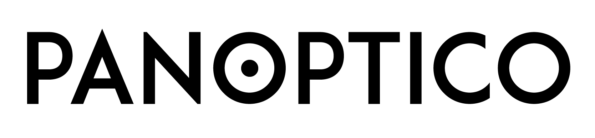

  

Projeto criado para a disciplina Tópicos Avançados em Programação Orientada a Objetos. O site permitirá visualizar os votos de partidos e deputados sobre determinados temas.  
Para mais detalhes sobre o [front-end](./frontend/README.md) e o [back-end](./backend/README.md), consulte o README no diretório correspondente.  

## Entregas
### Entrega 4: Requisito 7, requisito bônus e repaginada no front-end
Como alteramos todas as páginas do site, não é prático colocar todas os fotos nesse documento.
Vamos destacar algumas aqui, mas cada uma está detalhada no README de seus diretórios.

Detalhes sobre o [menu de seleção de ferramenta](https://gitlab.com/Vernalhav/politicaltracker/-/blob/develop/frontend/src/app/pages/monitor-menu/README.md).  
Detalhes sobre o [monitor de votações](https://gitlab.com/Vernalhav/politicaltracker/-/blob/develop/frontend/src/app/pages/mon-ent-votings/README.md).  
Detalhes sobre o [monitor de temas](https://gitlab.com/Vernalhav/politicaltracker/-/blob/develop/frontend/src/app/pages/mon-ent-subjects/README.md).  
Detalhes sobre o [monitor de projetos de lei](https://gitlab.com/Vernalhav/politicaltracker/-/blob/develop/frontend/src/app/pages/mon-ent-proposicoes/README.md).  
Detalhes sobre o [monitor de tema (versão nuvem)](https://gitlab.com/Vernalhav/politicaltracker/-/blob/develop/frontend/src/app/pages/mon-ent-votes-subjects/README.md).  

### Entrega 3: Requisito 5, melhoria do requisito 4

### Entrega 2: Requisitos 3, 4 e 6

-----

### Entrega 1: Requisitos 1 e 2

-----
